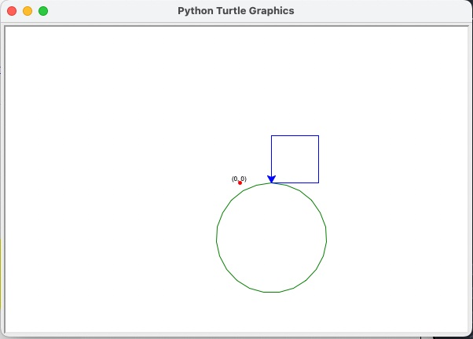

# Turtle Graphics

- Introduction
- A template
- Basic drawings

## Turtle Graphics Library

Turtle graphics is a drawing library shipped as part of Python standard library. It is available if the Python interpreter is installed properly.

It is an effective learning tool for beginners to understand programming concepts because it shows code execution graphically. It was originally used in [Logo programming language](<https://en.wikipedia.org/wiki/Logo_(programming_language)>) in 1967.

## Introduction

There is a so-called `turtle` in the Turtle graphics library. The turtle draws in a two-dimension screen using a Cartesian coordinate system. The coordinate system consists of a horizontal x-axis and a vertical y-axis. The unit is a screen pixel. The screen center has a coordination of `(0, 0)`.

The turtle has four basic attributes:

- a location of its `(x, y)` coordinates.
- an orientation of its head. It is the direction of its next move.
- a pen status of `down` or `up`. If the pen is `down`, it draws in the screen when it moves. Otherwise, it moves without drawing (no trace).
- a moving speed that you can set by its `speed(int_value)` method:
  - `0` and `10`: quickest
  - `1`: slowest

## Screen and Pen

The Turtle draws in a screen. You can import `Screen` from the Turtle graphics library and create one screen object using `screen = Screen()`.

A screen has many attributes, such as `window_height` (default is `1080`), `window_width` (default is `1720`) and a background color (default is `"white"`). You can customize these attributes at the beginning of your application.

A pen that has two attributes: a `color` for drawing color and a `width` for drawing line width.

Pen color can be string names such as `"blue"` or `"red"` or binary RGB values such as `(255, 255, 255)` for white color. When the pen is down and moves, it draws with the pen color.

It has a default color of `"black"` and a default width of `1` pixel.

## A Simple Template

A Python program executes sequentially, line by line, from top to the bottom. The following code creates a turtle using `t = turtle.Turtle()` function call and forwards `100` pixels. If this is the last line, the program exits and the turtle screen is closed.

To keep the screen open, add `t.screen.mainloop()` as the last statement.

- The `screen` is an _attribute_ of the newly created turtle `t`. It is a screen object that has a method `mainloop()`.
- Python use `.` operator to access object attributes and methods. The code `t.screen.mainloop()` calls the `mainloop()` method of the `screen` attribute of the object `t`.

The following is a simple template for all turtle demo applications.

```python
# turtle.py
import turtle

# create a turtle object
t = turtle.Turtle()

# all kinds of moves and drawings can be done here
t.speed(1)  # very slow
t.forward(100)

# this is the last statement to keep the screen open
t.screen.mainloop()
```

## A Demo Graphic Application

The following code is based on the previous template. It draws a circle and a square in screen with different colors.



```python
import turtle

# avoid magic numbers
SCREEN_WIDTH = 600
SCREEN_HEIGHT = 400
SKIP_DISTANCE = 40
SIDE_LENGTH = 60
NINETY_DEGREE = 90
REVERSE_DEGREE = 180
RADIUS = 70

screen = turtle.Screen()
screen.setup(SCREEN_WIDTH, SCREEN_HEIGHT)

# create a turtle
t = turtle.Turtle()

# move to right without drawing
t.penup()
t.forward(SKIP_DISTANCE)
t.pendown()

# reverse and draw a green circle
t.right(REVERSE_DEGREE)
t.color("green")
t.circle(RADIUS)

# reverse and draw a blue square
t.right(REVERSE_DEGREE)
t.color("blue")
t.forward(SIDE_LENGTH)
t.left(NINETY_DEGREE)
t.forward(SIDE_LENGTH)
t.left(NINETY_DEGREE)
t.forward(SIDE_LENGTH)
t.left(NINETY_DEGREE)
t.forward(SIDE_LENGTH)

t.screen.mainloop()
```
