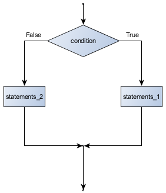
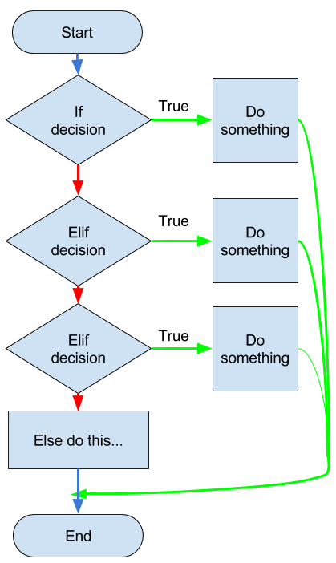

# Branch Statements

- Overview
- The `if` Statement
- Empty code block
- The `match` Statement

## Control Flow Overview

There are two type of activities happening all the time:

- You need to take different actions for different conditions. You take umbrella with you when it rains. A doctor writes different prescriptions for different symptoms and so on and so forth.
- You often repeat an operation until certain conditions are met. For example, keep running for one hour, lift 100lbs for 12 times, etc.

In both types, you need to control activities based on certain conditions. Python has four compound statements for _normal_ control flow purpose:

- branching: `if` and `match` statements
- Looping: `while` and `for` statements

When an exception happens in code execution, the normal execution flow stops. Python provides `try` statement to control exception handling. It is a big topic that will be covered later.

### Clauses and Indentation

All control flow statements are compound statements that contain multiple statements. A distinguish feature of Python is its use of indentation levels (leading spaces or tabs) to define the boundary of a compound statement. Most languages use indentation and specific delimiters such as parentheses `()` or curly bracket `{}`. Though it is possible to use one or more spaces/tabs as an indentation level, the suggested standard is 4 space character. Please stay with this suggestion.

A compound statement has one or more _clauses_. A clause consists of a _header_ and a _suite_. A header starts with a special keyword such as `if` or `for` and ends with a colon `:`. The clause headers of a compound statement are all at the same indentation level.

A header is followed by a group of statements that belong to the same clause. The group of statements is called a _code block_ or a _code suite_. All statements of a suite have the same level of indentation that is one level deeper than its clause header.

### Conditions Tests

Python uses **Boolean expressions** to represent conditions/tests used in compound statement clause headers. Boolean expressions are named after George Boole, an English mathematician who invented a logic system to compute true and false in the 1800s. A Boolean expression uses four types of operators:

- relational operators: compare two values to test a condition, evaluated to a boolean value of `True` or `False`.
- membership operators: `in` and `not in` are used to find if a value is a member of a sequence.
- identity operators: `is` and `is not` are used to check if _two variables_ refer to the same object.
- logical operators: `not`, `and`, and `or` are used to create a complex Boolean expression that consists of multiple subexpression/conditions. `and` and `or` operators support short circuiting.

## `if` Statement

It is common that you want to take some actions if a certain condition is true. In Python, it is coded in an `if` statement. At a conceptual level, you can think that an `if` statement as the following diagram:


### The `if` Syntax

The syntax for an `if statement` is as the following:

```python
if condition:
    statement
    statement
    etc.
```

The line `if condition:` is called an `if clause`. One or multiple statements below it, are grouped together and is called a `code block` or a `code suite`. _All statements in a code block have the same level of indentation_, i.e., they have the same number of leading spaces. Python style guide suggests using 4-space characters to indent a code block from its `if clause`. Forget tabs.

When Python runs an `if` statement, it evaluates the condition -- a boolean expression. If the boolean expression is `True`, it runs the code block following it. If the expression is false, it skips the code block following it. For example,

```python
number = int(input("Please enter an integer: "))
if number < 0:
    print(f'Negative input {number} changes to zero')
    number = 0

print(f'Double of {number} is {number * 2}')
```

### The `if-else` Statement

It is common for people to take some actions if a condition is true and take some other actions if the same condition is false. For example, in a Pass/Fail class, if a student's score is greater than or equal to 60 point, the grade is `Pass`, otherwise, the grade is `Fail`. The two-branch decision can be depicted using the following flow chart:



### The `if-else` Syntax

You can code the two-branch decision using the `if-else` statement that has the following syntax:

```python
if condition:
    statement
    statement
    ...
else:
   statement
   statement
   ...
```

The `if-else` statement has two clauses: an `if` clause and a an `else` clause. There is a code block for the `if` clause and a code block for `else` clause.

```python
PASS_SCORE = 60
score = int(input("Please enter your score points: "))
if score >= PASS_SCORE:
    print(f'Score of {score} is a pass score.')
    grade = 'Pass'
else:
    print(f'Score of {score} is a fail score.')
    grade = 'Fail'

print(f'Your grade is {grade}')
```

### Multiple Branches

For a course that is graded as `A`, `B`, `C`, `D` and `F`, you need more than two decision branches. You can use multiple `if-else` statement to process multiple branches as the following:

```python
A_SCORE = 90
B_SCORE = 80
C_SCORE = 70
D_SCORE = 60

score = int(input("Please enter your score: "))

if score >= A_SCORE:
    grade = "A"
else:
    if score >= B_SCORE:
        grade = "B"
    else:
        if score >= C_SCORE:
            grade = "C"
        else:
            if score >= D_SCORE:
                grade = "D"
            else:
                grade = "F"

print(f'The grade for score {score} is {grade}')
```

### The `if-elif-else` Statement

The previous code works correctly but many nested indentations are hard to read. The `if-elif-else` statement is used for three-or-more decision branches.



### The `elif` Syntax

The syntax is as the following:

```python
if condition:
    statement
    ...
elif condition:
    statement
    ...
elif condition:
    statement
    ...
# more elif if needed
else:
    statement
    ...
```

```python
# A better version
A_SCORE = 90
B_SCORE = 80
C_SCORE = 70
D_SCORE = 60

score = int(input("Please enter your score: "))

if score >= A_SCORE:
    grade = "A"
elif score >= B_SCORE:
    grade = "B"
elif score >= C_SCORE:
    grade = "C"
elif score >= D_SCORE:
    grade = "D"
else:
    grade = "F"

print(f'The grade for score {score} is {grade}')
```

### Compound Conditions Are Tricky

In real applications, the conditions could be very complex. Domain knowledge is important. To write correct and reliable code, splitting compound conditions into simple ones and use meaningful name for each condition. You should write thorough test cases for different scenarios.

As an example, is the following logic correct? If not, how to fix it?

```python
number1 = int(input("Please enter number 1: "))
number2 = int(input("Please enter number 2: "))

if (number1 > 0) and (number2 > 0):
    print("Both positive.")
elif (number1 < 0) and (number2 < 0):
    print("Both negative.")
else:
    print("One number is positive or zero and another is negative or zero.")
```

### Conditional Expression

The `if` and `else` keywords are also used in a _conditional expression_ to make code simpler. It is better to know this syntax because some people like it. Other people think that it is confusing and avoid it totally.

Below is a common logic in many applications:

```python
if condition:
    result = x
else:
    result = y
```

The four lines of code assign different value to the `result` based on a certain condition. If the condition logic is simple, Python you write it in one line: `result = x if condition else y`.

The code `x if condition else y` is called a conditional expression because it generates a value that can be used in anywhere a value can be used. Here, here the value is used an assignment statement.

## Empty code block

During the development, you may need time to decide the code block for a certain condition. However, Python reports a syntax error if a conditional clause is empty. For example, the following code has a syntax error: `IndentationError: expected an indented block`.

```python
x = 5
if x > 0:
    # haven't decided what to do here

print('Done')
```

### The `pass` Statement

You can put a `pass` statement as a placeholder to fix the empty block syntax error.

```python
x = 5
if x > 0:
    pass # it means that we will add code later

print('Done')
```

In addition to the `if`,`elif` and `else` clauses, the `pass` can also be used in a function definition.

```python
def my_function():
    pass
```

### The `Ellipsis` Value

Python has a built-in `ellipsis` type that has a single built-in constant value of `Ellipsis`. It can also be written as a literal value of `...`.

Many people use it as a placeholder for unwritten code or function documentation of type hints. It is often written at the same line of its clause header or function definition.

```python
x = 5
if x > 0:
    ...

print('Done')

def my_function(x: int): ...
```

## The `match` Statement

The 2021 release of Python 3.10 introduced a new control flow statement: the `match` statement that uses the _structural pattern match_ to control code execution. The structural pattern match is powerful because it can match data structures inside a composite data type such as a list, a tuple or a dictionary.

Below is its syntax

```python
match expression:
    case pattern1:
        # code block 1
    case pattern2:
        # code block 2
    case _: # wild card matches everything
        # code block for others

```

A pattern match can be simple value match, structural match, and even combined with conditions. The Python document [pep-0636](https://peps.python.org/pep-0636/) has more example.

```python
# A simple value match demo
# you can combine multiple matches
status = int(input("Please enter HTTP status code: "))
match status:
    case 200:
        status_text = "OK"
    case 301:
        status_text = "Moved Permanently"
    case 400 | 401:
        status_text = "Bad Request or Unauthorized"
    case 404:
        status_text = "Not found"
    case 500:
        status_text = "Internal Server Error"
    case _:
        status_text = "Something's wrong with the Internet"

print(status_text)
```

```python
# A structural match demo
# You can use variable to match different parts
# You can use if-guard to check more conditions

x_position = float(input("Please enter x coordinate: "))
y_position = float(input("Please enter y coordinate: "))
point = x_position, y_position

match point:
    case (0, 0):
        message = "The Origin"
    case (0, y):
        message = f"In x-axis: Y={y}"
    case (x, 0):
        message = f"In y-axis: X={x}"
    case (x, y) if x == y:
        message = f"On diagonal of X=Y={x}"
    case (x, y):
        message = f"Not on the diagonal X={x}, Y={y}"

print(message)

```
